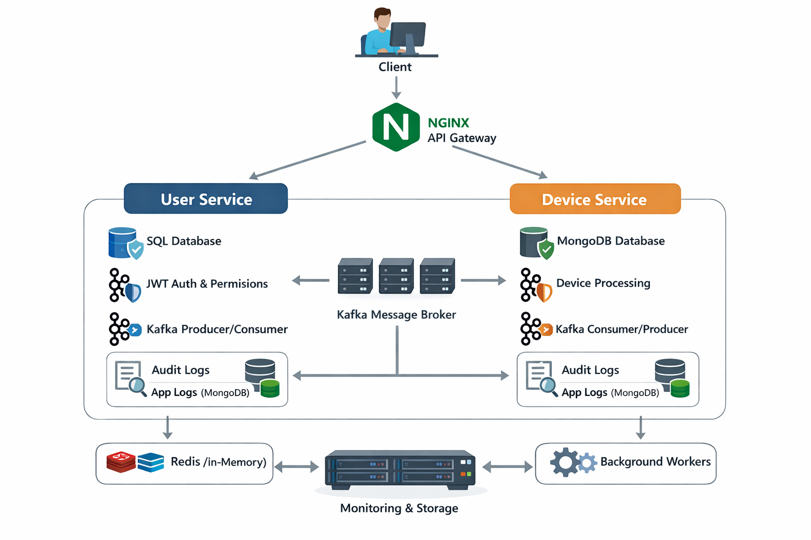

# DeviceManagement-Microservices

A production-grade event-driven microservices architecture built using .NET 8, Kafka, MongoDB, SQL Server, Redis, and Nginx.

This project demonstrates distributed system design principles including asynchronous processing, background services, caching abstraction, JWT security, and API gateway routing.

---

# Architecture Overview

The system follows a microservices architecture with an event-driven communication model.

Client → Nginx (API Gateway) → Microservices → Kafka → Background Processing → Databases

### High-Level Flow

Client
↓
Nginx (Reverse Proxy / Gateway)
↓
| |
UserService DeviceService
(SQL Server) (MongoDB)
↓ ↓
Kafka Producer Kafka Producer
↓ ↓
Kafka Consumer (Background Workers)
↓
Database + Cache Update

---

# Microservices

## 1️⃣ UserService

Responsibilities:

- User CRUD (SQL Server)
- JWT Token generation
- Authentication & Authorization
- Permission-based access control
- Kafka Producer & Consumer
- Cache abstraction (InMemory / Redis)
- Mongo-based Audit Logging (Bulk Insert)
- Application Logging Middleware

---

## 2️⃣ DeviceService

Responsibilities:

- Device CRUD (MongoDB)
- JWT Validation
- Permission enforcement
- Kafka Producer & Consumer
- Cache abstraction (InMemory / Redis)
- Background bulk audit logging
- Application Logging Middleware

---

# Permissions Model

| ID | Permission        |
|----|------------------|
| 1  | View Device      |
| 2  | Edit Device      |
| 3  | Delete Device    |
| 4  | Add Device       |
| 5  | Health           |
| 6  | Logs             |
| 7  | Create User      |
| 8  | Edit User        |
| 9  | Delete User      |

Permissions are stored as comma-separated values in SQL Server and validated via custom authorization attributes.

---

# Core Concepts Implemented

- Event-driven architecture using Kafka
- Asynchronous background processing
- Bulk audit logging with thread-safe in-memory queue
- Redis / InMemory cache switching via configuration
- JWT Authentication with claims-based authorization
- Reverse proxy routing using Nginx
- Centralized logging to MongoDB
- Clean separation of concerns (Controller → Service → Repository)

---

# Technologies Used

- .NET 8
- MongoDB
- SQL Server
- Apache Kafka
- Redis
- Nginx
- Docker Compose
- JWT (Bearer Authentication)

---

# Infrastructure Setup

Refer to the `infrastructure` folder for detailed setup guides:

- kafka-setup.md
- redis-setup.md
- mongo-setup.md
- sql-setup.md
- nginx.conf
- docker.md

---

# Docker Setup (Full Infrastructure)

This project supports complete containerized startup using Docker Compose.

## Prerequisites

- Install Docker Desktop
- Ensure Docker is running

Verify installation:

docker --version
docker compose version

---

## Start Entire System

From project root:

docker compose up --build

This will start:

- Zookeeper
- Kafka
- MongoDB
- Redis
- SQL Server
- UserService
- DeviceService
- Nginx

---

## Create Kafka Topics (After Startup)

Find Kafka container:

docker ps

Enter container:

docker exec -it <kafka_container_name> bash

Create required topics:

kafka-topics --create --topic user-commands --bootstrap-server kafka:9092
kafka-topics --create --topic device-commands --bootstrap-server kafka:9092

---

## Access Application

Through Nginx:

http://localhost/api/auth/login
http://localhost/api/users
http://localhost/api/devices

---

## Stop System

docker compose down

---

# Architecture Diagram

---

# Project Highlights

This project demonstrates:

- Real-world microservice separation
- Distributed caching strategy
- Message-driven architecture
- Secure authentication model
- Gateway-based routing
- Background batch processing
- Infrastructure reproducibility via Docker

---

# Author

Javed Miya